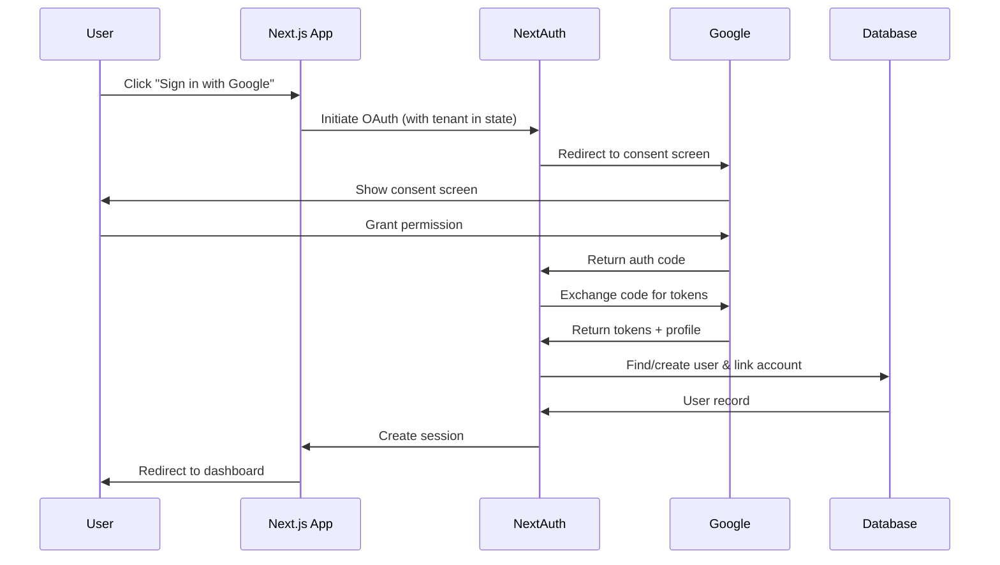

# Design Document: Google OAuth Implementation

## Overview

This design document outlines the implementation of Google OAuth authentication for the multi-tenant SaaS boilerplate. The solution integrates with the existing NextAuth.js v5 setup, adding Google as an OAuth provider while maintaining tenant isolation and supporting both new user registration and existing account linking.

## Architecture

The Google OAuth implementation follows the standard OAuth 2.0 authorization code flow, integrated with NextAuth.js:



### Key Design Decisions

1. **NextAuth.js Accounts Table**: Use NextAuth's built-in account linking pattern with a new `accounts` table to store OAuth provider connections
2. **Tenant State Preservation**: Encode tenant slug in OAuth state parameter to maintain context through the redirect flow
3. **Optional Password**: Users created via OAuth have nullable `passwordHash`, allowing password-only users to exist alongside OAuth-only users
4. **Account Linking by Email**: When a Google account email matches an existing user in the same tenant, automatically link the accounts

## Components and Interfaces

### Database Schema Changes

```typescript
// New accounts table for OAuth provider connections
export const accounts = pgTable(
  "accounts",
  {
    id: text("id").primaryKey().$defaultFn(() => crypto.randomUUID()),
    userId: text("user_id")
      .notNull()
      .references(() => users.id, { onDelete: "cascade" }),
    type: text("type").notNull(), // "oauth" | "credentials"
    provider: text("provider").notNull(), // "google" | "credentials"
    providerAccountId: text("provider_account_id").notNull(),
    refresh_token: text("refresh_token"),
    access_token: text("access_token"),
    expires_at: integer("expires_at"),
    token_type: text("token_type"),
    scope: text("scope"),
    id_token: text("id_token"),
    createdAt: timestamp("created_at").defaultNow().notNull(),
  },
  (table) => [
    uniqueIndex("accounts_provider_account_idx").on(table.provider, table.providerAccountId),
    index("accounts_user_idx").on(table.userId),
  ]
);

// Update users table - make passwordHash nullable
export const users = pgTable("users", {
  // ... existing fields
  passwordHash: text("password_hash"), // Now nullable for OAuth-only users
});
```

### NextAuth Configuration Updates

```typescript
// src/lib/auth.ts additions
import Google from "next-auth/providers/google";

export const { handlers, signIn, signOut, auth } = NextAuth({
  providers: [
    Google({
      clientId: env.GOOGLE_CLIENT_ID,
      clientSecret: env.GOOGLE_CLIENT_SECRET,
      authorization: {
        params: {
          prompt: "consent",
          access_type: "offline",
          response_type: "code",
        },
      },
    }),
    Credentials({ /* existing config */ }),
  ],
  callbacks: {
    async signIn({ user, account, profile }) {
      // Handle tenant context and account linking
    },
    // ... existing callbacks with OAuth support
  },
});
```

### Component Interfaces

```typescript
// Google OAuth button props
interface GoogleAuthButtonProps {
  mode: "signin" | "signup";
  tenantSlug?: string;
  className?: string;
}

// OAuth state parameter structure
interface OAuthState {
  tenantSlug: string;
  callbackUrl?: string;
}
```

## Data Models

### Account Model

| Field | Type | Description |
|-------|------|-------------|
| id | string | Primary key (UUID) |
| userId | string | Foreign key to users table |
| type | string | Account type ("oauth") |
| provider | string | Provider name ("google") |
| providerAccountId | string | Google's unique user ID |
| refresh_token | string? | OAuth refresh token |
| access_token | string? | OAuth access token |
| expires_at | number? | Token expiration timestamp |
| token_type | string? | Token type (usually "Bearer") |
| scope | string? | Granted OAuth scopes |
| id_token | string? | OpenID Connect ID token |
| createdAt | timestamp | Record creation time |

### Updated User Model

The `passwordHash` field becomes nullable to support OAuth-only users:
- Users created via credentials: `passwordHash` is required
- Users created via OAuth: `passwordHash` is null (can set later)
- Users with both: `passwordHash` is set, plus linked account record

## Correctness Properties

*A property is a characteristic or behavior that should hold true across all valid executions of a system-essentially, a formal statement about what the system should do. Properties serve as the bridge between human-readable specifications and machine-verifiable correctness guarantees.*

### Property 1: OAuth Token Extraction Correctness
*For any* valid Google OAuth profile response, the extraction logic SHALL correctly parse and return the user's email, name, and Google account ID without data loss or corruption.
**Validates: Requirements 1.2**

### Property 2: Account Linking Consistency
*For any* existing user with email E in tenant T, when Google OAuth completes with the same email E for tenant T, the system SHALL link the Google account to the existing user and the user's ID SHALL remain unchanged.
**Validates: Requirements 1.3, 2.4**

### Property 3: New User Creation with Correct Tenant
*For any* Google OAuth completion where no user exists with the given email in the target tenant, the system SHALL create a new user with role "member" assigned to that specific tenant.
**Validates: Requirements 1.4, 2.2, 3.2**

### Property 4: Tenant Context Round-Trip
*For any* tenant slug encoded in the OAuth state parameter, decoding the state after OAuth callback SHALL return the exact same tenant slug.
**Validates: Requirements 3.1**

### Property 5: CSRF State Validation
*For any* OAuth callback request, if the state parameter is missing, malformed, or does not match the expected format, the system SHALL reject the request and redirect to the login page with an error.
**Validates: Requirements 4.2**

### Property 6: Password Fallback After Unlink
*For any* user who has both a Google account linked AND a password set, if the Google account is unlinked, the user SHALL still be able to authenticate using their password.
**Validates: Requirements 4.4**

## Error Handling

### OAuth Error Scenarios

| Error Type | Handling | User Message |
|------------|----------|--------------|
| User denies consent | Redirect to login | "Google sign-in was cancelled" |
| Invalid state parameter | Redirect to login | "Authentication failed. Please try again." |
| Tenant not found | Redirect to login | "Organization not found" |
| Tenant suspended | Redirect to login | "This organization has been suspended" |
| Google API error | Log + redirect | "Unable to connect to Google. Please try again." |
| Account already linked to different user | Redirect to login | "This Google account is already linked to another user" |

### Error Logging

- All OAuth errors are logged server-side with request context
- Sensitive data (tokens, full profile) is never logged
- Error messages to users are generic to prevent information leakage

## Testing Strategy

### Property-Based Testing

The implementation will use **fast-check** for property-based testing in TypeScript/JavaScript.

Each property-based test will:
- Run a minimum of 100 iterations
- Be tagged with a comment referencing the correctness property
- Use format: `**Feature: google-oauth, Property {number}: {property_text}**`

### Unit Tests

Unit tests will cover:
- OAuth state encoding/decoding
- User lookup and creation logic
- Account linking logic
- Error handling paths

### Integration Tests

Integration tests will verify:
- Full OAuth flow with mocked Google responses
- Tenant context preservation through redirects
- Session creation after successful OAuth

### Test Structure

```
src/
├── lib/
│   └── oauth/
│       ├── state.ts           # State encoding/decoding
│       ├── state.test.ts      # Unit + property tests
│       ├── account-linking.ts # Account linking logic
│       └── account-linking.test.ts
```

